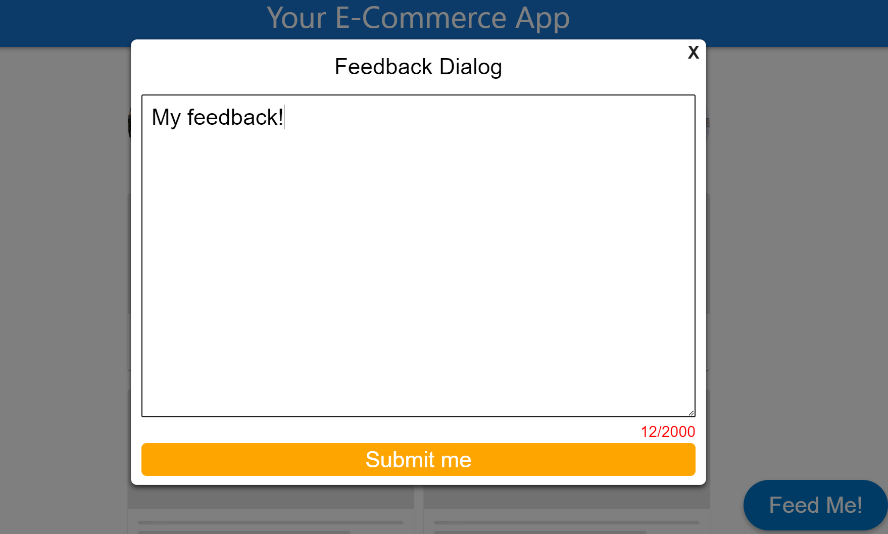

# Feedbacky

## About Project
This is a component library for e-commerce web sites.


<br/>





<br/>

This document (prod) will be completed as soon as possible,


🧪 100% component coverage <br>
✔️ Rollup bundled succesfully (just 34kB !) <br>
✔️ e2e tests with cypress in demo-app <br>
✔️ Online Demo: https://feedbacky-page.vercel.app/ <br>
✔️ Storybook: https://feedbacky-story.vercel.app/ <br>
✔️ e2e tests with cypress in demo-app <br>
✔️ spreadsheet as a db https://docs.google.com/spreadsheets/d/1P8H5ELZYyeVkw7DltKO_alb6RqBomTHLlwyYw-dVQfQ/edit#gid=0

## Dependencies

### `npm i --legacy-peer-deps`

To install required packages via NPM 

## Available Scripts

In the component project directory, you can run:

For unit tests:


### `npm test`

Launches the test runner in the interactive watch mode.\
See the section about [running tests](https://jestjs.io/) for more information.
(you can find coverage report in "coverage" dist in folder)
in package json:
```js
 "scripts": {
      ...
       ...
    "test": "jest --watchAll --coverage", 
        ...
  },
```
### `npm run rollup`

Rollup is a module bundler for JavaScript which compiles small pieces of code into something larger and more complex, such as a library or application. It uses the standardized ES module format for code, instead of previous idiosyncratic solutions such as CommonJS and AMD. ES modules let you freely and seamlessly combine the most useful individual functions from your favorite libraries. Rollup can optimize ES modules for faster native loading in modern browsers, or output a legacy module format allowing ES module workflows today.

in package json :
```js
 "scripts": {
      ...
       ...
    "rollup": "rollup -c", //You find rollup configurations in rollup.config.js
        ...
  },
```

## Usage

Import the `<Feedbacky />` component near the top of your application's tree.

You can use the component like this simply (Please see demo-app):

```js
import React from 'react'
import { Feedbacky } from "../@feedbacky-feature-dir"

export default function App() {
  return (
    <>
        <App />
        <Feedbacky />
    <>

  )
}
```

Or you can use by separately (Please see demo-app):

```js
import React from "react";
import { FeedbackButton, FeedbackDialog } from "../@feedbacky-feature-dir";

export default function App() {
  const [isOpen, setIsOpen] = useState(false);

  const open = () => {
    setIsOpen(true);
  };
  const close = () => {
    setIsOpen(false);
  };
  return (
    <>
      <FeedbackButton {...feedbackButtonOptions} onClick={open} />
      <FeedbackDialog {...feedbackDialogOptions} isOpen={isOpen} handleClose={close} />
    </>
  );
}
```

## API & Props

#### Top-Level Exports

- `<Feedbacky>`
  - `<FeedbackButton>`
  - `<FeedbackDialog>`

<hr>

### `<Feedbacky>`

Sets the component where `<FeedbackDialog> and <FeedbackButton> `s will be rendered.

- **Feedbacky Props**
  <br />

| Name            | Type               | Default | Description                              |     |
| --------------- | ------------------ | ------- | ---------------------------------------- | --- |
| feedbackyDialog | FeedbackDialogType | -       | Feedback Dialog Style and Event Settings |     |
| feedbackyButton | FeedbackButtonType | -       | Feedback Button Style settings           |     |
|                 |                    |         |                                          |     |

- **FeedbackDialog Props**
<br />

<table>
  <tr>
  	<th>Name</th>
		<th>Type</th>
		<th>Default </th>
	   <th>Description</th>
  </tr>
   <tr>
  		<td>headerSize</td>
   		<td>"xlarge"|"large"|"medium"|"small"</td>
		<td>"medium"</td>
		<td>set the header size of dialog</td>
</tr>
 	</tr>
   <tr>
  		<td>headerText</td>
   		<td>string</td>
		<td>"Feedback Dialog"</td>
		<td>set the header text of dialog</td>
</tr>
 	</tr>
  <tr>
  		<td>headerVariant</td>
   		<td>"primary" | "purple" | "danger" | "warning" | "pink" | "white" | "orange"  </td>
		<td>"white"</td>
		<td>set the header variant of dialog</td>
</tr>
 	</tr>
  
  <tr>
  		<td>submitButtonText</td>
   		<td>string</td>
		<td>"Submit"</td>
		<td>set the submit button text</td>
</tr>
 	</tr>
   <tr>
  		<td>submitButtonSize</td>
   		<td>"xlarge"|"large"|"medium"|"small"</td>
		<td>"medium"</td>
		<td>set the submit button size </td>
</tr>
 	</tr>
     <tr>
  		<td>submitButtonVariant</td>
   		<td>"primary" | "purple"| "danger" | "warning" | "pink" | "white" | "orange" </td>
		<td> "orange" </td>
		<td>set the submit button variant </td>
</tr>
 	</tr>

  <tr>
  		<td>messageMaxLenght</td>
   		<td>number</td>
		<td>2000</td>
		<td>set the max feedback message length on textarea</td>
 	</tr>
<tr>
	<td>messageFontSize</td>
   		<td>"xlarge"|"large"|"medium"|"small"</td>
		<td>"medium"</td>
		<td>set the feedback message fontsize</td>
 	</tr>
<tr>
<td>isOpen</td>
   		<td>boolean</td>
		<td>false</td>
		<td>set dialog status</td>
 	</tr>

<tr>
<tr>
<td>dbURL</td>
   		<td>string</td>
		<td>https://sheetdb.io/api/v1/d4iorc1s9betr</td>
		<td>set the dialog request dbURL ( note: your success response status should be 201)</td>
 	</tr>
  <td>opactity</td>
   		<td>string</td>
		<td>"0.5"</td>
		<td>set the dialog warpper background's opacity</td>
 	</tr>
  <td>errorMsg</td>
   		<td>string</td>
		<td>Error has been occured!</td>
		<td>shown message when dialog's message response bad </td>
 	</tr>
  <td>succesMsg</td>
   		<td>string</td>
		<td>We have got your feedback!</td>
		<td>shown message when dialog's message response success</td>
 	</tr>

</table>

- **FeedbackButton Props**

<table>
  <tr>
  	<th>Name</th>
		<th>Type</th>
		<th>Default </th>
	  <th>Description</th>
  </tr>
   <tr>
  		<td>text</td>
   		<td>string</td>
		<td>"Feed Me!""</td>
		<td>set the feedback dialog button text</td>
</tr>
 	</tr>
   <tr>
  		<td>size</td>
   		<td>"xlarge"|"large"|"medium"|"small"</td>
		<td>"medium"</td>
		<td>set the button size </td>
</tr>
 	</tr>
   <tr>
  		<td>variant</td>
   		<td>"primary" | "purple"| "danger" | "warning" | "pink" | "white" | "orange" </td>
		<td>"primary"</td>
		<td>set the button variant! </td>
</tr>
 	</tr>
  	</tr>
   <tr>
  		<td>shape</td>
   		<td>"Pill"|"Recatangle"</td>
		<td>"Pill"</td>
		<td>set the button size </td>
</tr>
 	</tr>


</table>

_Example:_

```js
 import {Feedbacky} from ".."
export default function App() {
   const buttonOptions:CommonButtonProp={
    text: "Feed Me!",
    variant: "primary",
    size: "large",
    shape: "Pill"
  }
  const dilaogOptions:FeedbackDialogType={
    ///////////// DEFAULTS \\\\\\\\\\\\\\\\\\\\
    //submit button options
    submitButtonShape:"Pill",
    submitButtonText:"Submit",
    submitButtonVariant:"orange",
    submitButtonSize:"large",
    //header options
    headerText:"Feedback Dialog",
    headerSize:"medium",
    headerVariant:"white",
    //message box  option
    messageFontSize:"medium",
    messageMaxLenght:2000,
    //opacity
    opacity:"0.5",
    dbURL:"https://sheetdb.io/api/v1/d4iorc1s9betr", // your google sheet api etc. url i used sheet db
    succesMsg:"We have got your feedback!", //if your feedback will be sent by successfully , show this message
    // Has init init value ==> valid "We got your feedback!"
    errorMsg:"Error has been occurred!", //if your feedback  couldn't be sent, show this err message
    // Has init init value ==> valid "Error has been occurred!"
  }
  return (
    <>
      <Layout />
      <Feedbacky feedbackyDialog={dilaogOptions} feedbackyButton={buttonOptions}/>
    </>
  )
}
```

